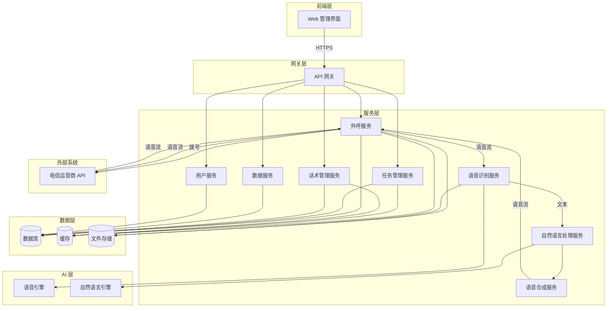
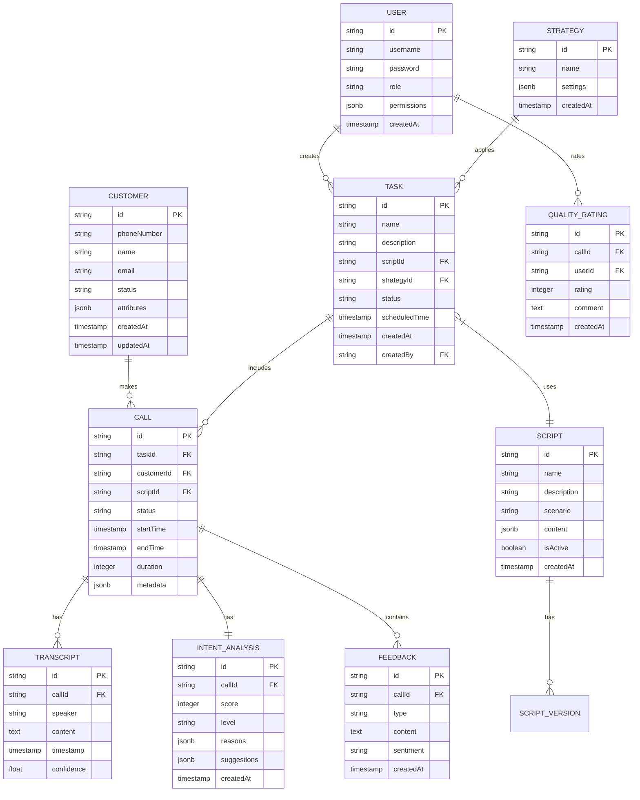

# AI 电销语音机器人系统设计文档

功能名称: 2026-02-10-ai-sales-bot
更新日期: 2026-02-10

## 描述

AI 电销语音机器人系统是一个基于语音识别、自然语言处理和数据分析技术的智能电话销售系统。系统采用微服务架构,包含智能外呼、语音识别、自然语言理解、对话生成和数据分析等核心模块,支持高并发外呼、实时语音处理和智能销售决策。

## 架构

系统采用前后端分离的微服务架构,主要包含以下层次:

- **前端层**: Web 管理界面,提供用户交互
- **网关层**: API 网关,处理请求路由和认证
- **服务层**: 各业务微服务,处理具体业务逻辑
- **数据层**: 数据库和缓存,存储业务数据
- **AI 层**: 语音识别和自然语言处理服务



## 组件和接口

### 1. 外呼服务 (Outbound Service)

**职责**: 管理电话外呼流程,处理通话连接和语音流传输

**主要接口**:

```typescript
// 创建外呼任务
POST /api/outbound/tasks
Request: {
  name: string,
  phoneNumbers: string[],
  scriptId: string,
  strategyId: string,
  scheduledTime?: Date
}
Response: { taskId: string }

// 启动任务
POST /api/outbound/tasks/{taskId}/start

// 暂停任务
POST /api/outbound/tasks/{taskId}/pause

// 查询任务状态
GET /api/outbound/tasks/{taskId}/status

// 获取通话列表
GET /api/outbound/calls?taskId={taskId}&page={page}&size={size}

// 获取通话详情
GET /api/outbound/calls/{callId}
Response: {
  callId: string,
  phoneNumber: string,
  status: 'calling' | 'connected' | 'ended' | 'failed',
  startTime: Date,
  endTime?: Date,
  duration?: number,
  transcript: CallTranscript[],
  intentAnalysis?: IntentResult,
  rating?: number
}
```

**事件**:
- `CallStarted`: 通话开始
- `CallConnected`: 通话接通
- `CallEnded`: 通话结束
- `CallFailed`: 通话失败
- `TranscriptReceived`: 收到识别文本
- `IntentRecognized`: 意图识别完成

### 2. 语音识别服务 (ASR Service)

**职责**: 将客户语音实时转换为文本

**主要接口**:

```typescript
// 开始语音识别
POST /api/asr/start
Request: {
  callId: string,
  language: 'zh-CN' | 'en-US'
}
Response: { sessionId: string }

// 接收语音流
POST /api/asr/stream
Request: {
  sessionId: string,
  audioData: ArrayBuffer
}
Response: {
  text: string,
  confidence: number,
  isFinal: boolean
}

// 结束识别
POST /api/asr/end
Request: { sessionId: string }
```

### 3. 自然语言处理服务 (NLP Service)

**职责**: 理解客户意图,提取关键信息,生成回复

**主要接口**:

```typescript
// 意图识别
POST /api/nlp/intent
Request: {
  text: string,
  context: ConversationContext,
  scriptId: string
}
Response: {
  intent: string,
  confidence: number,
  entities: Entity[],
  suggestions: string[]
}

// 生成回复
POST /api/nlp/response
Request: {
  intent: string,
  entities: Entity[],
  scriptId: string,
  context: ConversationContext
}
Response: {
  response: string,
  variables: Record<string, any>,
  nextAction?: 'transfer_to_human' | 'schedule_callback' | 'end_call'
}

// 客户意向分析
POST /api/nlp/analyze-intent
Request: {
  callId: string,
  transcript: CallTranscript[]
}
Response: {
  intentScore: number,  // 0-100
  level: 'high' | 'medium' | 'low' | 'none',
  reasons: string[],
  suggestions: string[]
}

// 产品反馈提取
POST /api/nlp/extract-feedback
Request: {
  transcript: CallTranscript[],
  productId?: string
}
Response: {
  feedbacks: Feedback[],
  sentiment: 'positive' | 'negative' | 'neutral'
}
```

**数据模型**:

```typescript
interface Entity {
  type: string,        // entity 类型,如 'product', 'price', 'quantity'
  value: any,          // 提取的值
  confidence: number,  // 置信度
  position: { start: number, end: number }
}

interface ConversationContext {
  callId: string,
  turnCount: number,
  history: Array<{
    role: 'customer' | 'agent',
    text: string,
    timestamp: Date
  }>,
  variables: Record<string, any>
}

interface CallTranscript {
  speaker: 'customer' | 'agent',
  text: string,
  timestamp: Date,
  confidence?: number
}

interface Feedback {
  type: 'product_quality' | 'price' | 'service' | 'feature' | 'other',
  content: string,
  sentiment: 'positive' | 'negative' | 'neutral',
  timestamp: Date
}
```

### 4. 语音合成服务 (TTS Service)

**职责**: 将文本转换为语音流

**主要接口**:

```typescript
// 语音合成
POST /api/tts/synthesize
Request: {
  text: string,
  voice: 'female' | 'male',
  speed?: number,
  pitch?: number
}
Response: {
  audioUrl: string,
  duration: number
}

// 实时语音合成流
WebSocket /api/tts/stream
```

### 5. 任务管理服务 (Task Service)

**职责**: 管理外呼任务的创建、调度和执行

**主要接口**:

```typescript
// 创建任务
POST /api/tasks
Request: {
  name: string,
  description?: string,
  scriptId: string,
  strategyId: string,
  customerIds: string[],
  scheduledTime?: Date
}
Response: { taskId: string }

// 更新任务
PUT /api/tasks/{taskId}

// 删除任务
DELETE /api/tasks/{taskId}

// 查询任务列表
GET /api/tasks?status={status}&page={page}&size={size}

// 获取任务统计
GET /api/tasks/{taskId}/statistics
Response: {
  total: number,
  completed: number,
  connected: number,
  highIntent: number,
  averageDuration: number
}
```

### 6. 话术管理服务 (Script Service)

**职责**: 管理话术模板的创建、编辑和版本控制

**主要接口**:

```typescript
// 创建话术
POST /api/scripts
Request: {
  name: string,
  description?: string,
  scenario: string,
  content: ScriptContent
}
Response: { scriptId: string }

// 更新话术
PUT /api/scripts/{scriptId}

// 获取话术详情
GET /api/scripts/{scriptId}

// 话术预览
POST /api/scripts/preview
Request: {
  scriptContent: ScriptContent,
  customerContext: Record<string, any>
}
Response: {
  conversation: Array<{ role: string, text: string }>
}

// 获取话术版本列表
GET /api/scripts/{scriptId}/versions
```

**话术内容结构**:

```typescript
interface ScriptContent {
  nodes: ScriptNode[],
  edges: ScriptEdge[]
}

interface ScriptNode {
  id: string,
  type: 'start' | 'question' | 'statement' | 'condition' | 'transfer' | 'end',
  content: string,
  intent?: string,
  nextNodeId?: string,
  branches?: {
    condition: string,
    nextNodeId: string
  }[]
}

interface ScriptEdge {
  source: string,
  target: string,
  label?: string
}
```

### 7. 数据服务 (Data Service)

**职责**: 提供数据查询、统计和报表生成功能

**主要接口**:

```typescript
// 查询通话列表
GET /api/data/calls?filters={filters}&page={page}&size={size}

// 通话统计
GET /api/statistics/overview?dateRange={dateRange}
Response: {
  totalCalls: number,
  connectedRate: number,
  avgDuration: number,
  intentDistribution: {
    high: number,
    medium: number,
    low: number,
    none: number
  },
  topScripts: Array<{ scriptId: string, name: string, count: number }>
}

// 导出报表
POST /api/data/export
Request: {
  reportType: 'calls' | 'intents' | 'feedbacks',
  filters: Record<string, any>,
  format: 'excel' | 'csv'
}
Response: { downloadUrl: string }

// 质检评分
POST /api/data/quality-rating
Request: {
  callId: string,
  rating: number,
  comment?: string
}
```

### 8. 用户服务 (User Service)

**职责**: 用户认证、授权和权限管理

**主要接口**:

```typescript
// 用户登录
POST /api/auth/login
Request: { username: string, password: string }
Response: { token: string, user: UserInfo }

// 创建用户
POST /api/users
Request: {
  username: string,
  password: string,
  role: string,
  permissions: string[]
}

// 分配权限
POST /api/users/{userId}/permissions

// 查询用户列表
GET /api/users?role={role}
```

## 数据模型

### 核心数据表



## 正确性属性

### 外呼服务不变性

- 通话状态必须按顺序转换: `calling` → `connected` → `ended` 或 `failed`
- 同一电话号码在同一任务中只能拨打一次
- 已暂停的任务不能产生新的拨号操作

### 话术执行不变性

- 话术节点必须从 `start` 节点开始执行
- 条件节点的分支必须互斥且完全覆盖所有情况
- 对话上下文中的 `turnCount` 必须随对话轮次递增

### 意向分析不变性

- 意向评分必须在 0-100 范围内
- 意向等级与评分必须一致: `high` (70-100), `medium` (40-69), `low` (1-39), `none` (0)

### 数据一致性

- 所有通话记录必须关联有效的外呼任务
- 所有识别文本必须关联有效的通话记录
- 所有用户操作必须记录在操作日志中

## 错误处理

### 通话相关错误

```typescript
// 拨号失败
class OutboundCallError extends Error {
  constructor(
    public callId: string,
    public reason: 'busy' | 'no_answer' | 'network_error' | 'invalid_number'
  ) {
    super(`Call ${callId} failed: ${reason}`)
  }
}

// 语音识别超时
class ASRTimeoutError extends Error {
  constructor(public sessionId: string, public timeout: number) {
    super(`ASR session ${sessionId} timed out after ${timeout}ms`)
  }
}

// 对话逻辑中断
class DialogueInterruptError extends Error {
  constructor(public callId: string, public currentNode: string) {
    super(`Dialogue interrupted at node ${currentNode}`)
  }
}
```

### 处理策略

1. **拨号失败**: 记录失败原因,根据策略决定是否重拨
2. **语音识别失败**: 降级为人工转接,记录失败日志
3. **意图识别低置信度**: 使用兜底话术,标记为不确定状态
4. **服务异常**: 优雅降级,确保通话数据不丢失
5. **网络中断**: 重试机制,超过阈值则结束通话

## 测试策略

### 单元测试

- 各服务的业务逻辑测试
- 意图识别算法准确性测试
- 话术分支逻辑测试
- 数据模型验证测试

### 集成测试

- 服务间接口集成测试
- 完整通话流程测试
- 外呼任务执行测试
- 数据流转一致性测试

### 性能测试

- 并发外呼能力测试 (目标: 100 并发)
- 语音识别延迟测试 (目标: < 500ms)
- 意图识别响应时间 (目标: < 300ms)
- 数据库查询性能测试

### 准确性测试

- 语音识别准确率测试 (目标: 中文 > 95%)
- 意图识别准确率测试 (目标: > 90%)
- 客户意向评分相关性测试

### 稳定性测试

- 长时间运行稳定性测试
- 异常情况恢复测试
- 数据备份和恢复测试

## 参考资料

[1]: (https://cloud.google.com/speech-to-text) - Google Cloud Speech-to-Text API
[2]: (https://aws.amazon.com/polly/) - Amazon Polly 文字转语音服务
[3]: (https://developer.mozilla.org/en-US/docs/Web/API/Web_Speech_API) - Web Speech API 文档
[4]: (https://rasa.com/docs/) - Rasa 对话系统框架
[5]: (https://www.twilio.com/docs/voice) - Twilio 语音服务 API
